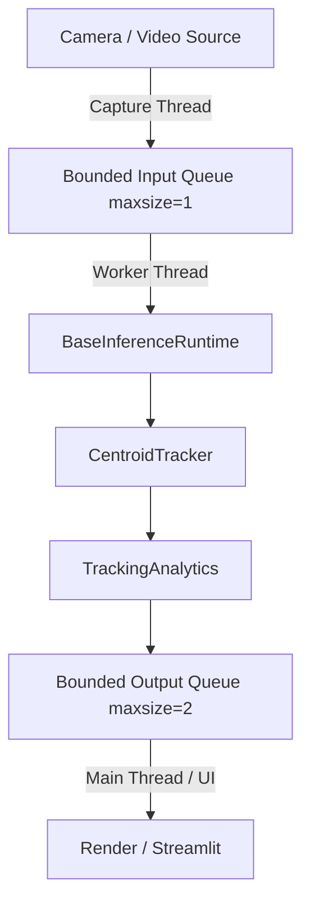

# Real-Time Asynchronous Pipeline Architecture

EdgeVision AI utilizes a bounded asynchronous producer-consumer architecture to achieve zero-lag inference.

## Architecture

## Freshness-Oriented Frame Processing (Drop Policy)
If the capture thread produces frames faster than the inference thread can process them, stale frames will naturally accumulate in a synchronous architecture, leading to seconds of lag.

To resolve this, the `AsyncRealtimePipeline` employs an **explicit drop strategy**:
- The `input_queue` has a size of 1.
- If the producer attempts to push a frame when the queue is full, it forcibly removes the existing stale frame (`queue.get_nowait()`) and inserts the newest one.
- This guarantees that the inference worker always receives the most recent physical frame.

## Tracking Under Frame Drops
Because frames may be dropped, the tracking algorithm must gracefully handle temporal gaps.
The `CentroidTracker` uses a `max_missed_frames` tolerance, allowing objects to be tracked even if detection misses them for multiple consecutive frames. This prevents track fragmentation under high drop rates.

## Graceful Shutdown
The pipeline guarantees zero orphaned threads:
1. Producer sets `_capture_finished` upon EOF or camera disconnect.
2. The `stop()` method triggers `_stop_event`.
3. Queues are manually unblocked.
4. Threads are joined.

## Metrics
Detailed metrics are tracked via a rolling window:
- **Capture FPS**: The true hardware framerate.
- **Processing FPS**: The rate at which the pipeline outputs annotated frames.
- **Dropped Frames**: Count of frames discarded to preserve freshness.
- **Latencies**: End-to-end processing P50/P95 latencies, including detection and tracking breakdown.
